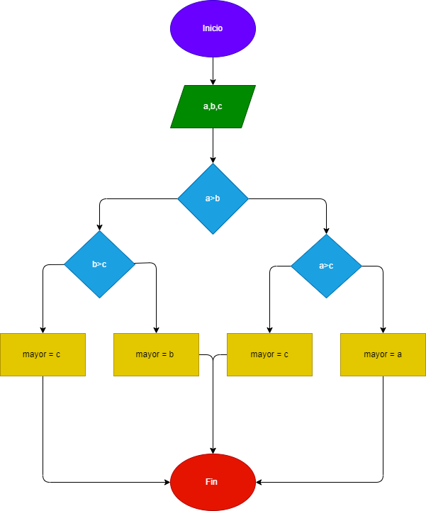

# Analisar , Diseñar y contruir un programa para hallar el mayor de tres numeros enteros   

## Diagrama de flujo 
Programa elcual halle el mayor de tres numeros enteros   

if a>b:
    if a>c:
        mayor = a
    else:
        mayor = c 
if b>c: 
    mayor = b 
else:
    mayor = c  
